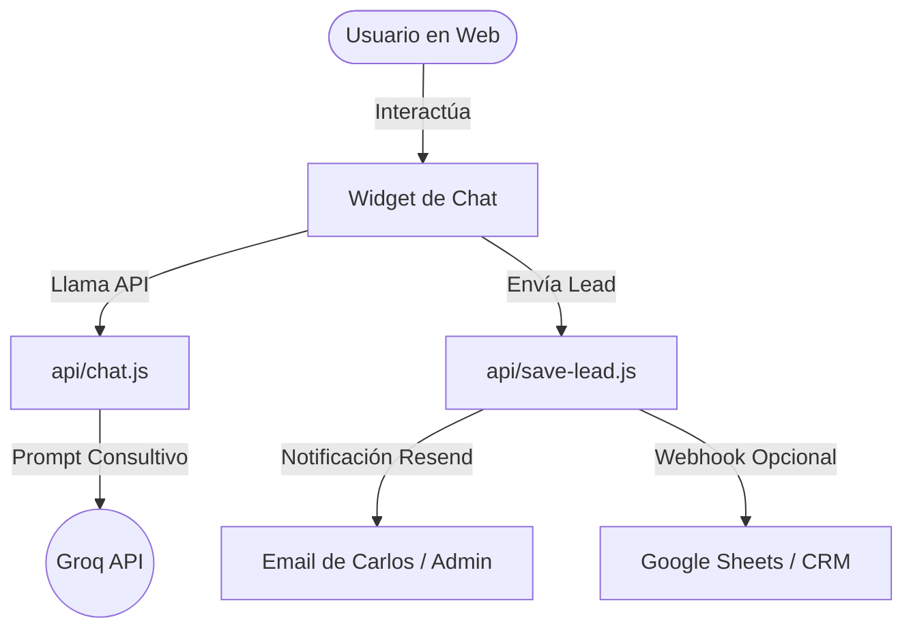

# Especificación de Diseño: Optimización de Chat Consultivo, Captura de Leads y Sección "Nosotros"

Este documento establece la arquitectura y detalles de implementación para mejorar el widget de chat, corregir la navegación del sitio y agregar la sección de autoridad "Nosotros".

---

## 1. Módulos y Arquitectura



---

## 2. Componente 1: Flujo Conversacional y Captura de Leads

### A. Tono y Asesoramiento Consultivo (Backend - `api/chat.js`)
El prompt de sistema se actualizará para guiar al asistente como un **asesor de ventas de alto nivel** que:
- Comparte valor general (ideas de conversión, tips de SEO local, conceptos de automatización).
- Ofrece un "Lead Magnet" (Guía de Estructura Web, Checklist SEO, o Catálogo de Automatización) de forma oportuna.
- No regala diagnósticos técnicos exhaustivos.

#### Reglas del Prompt:
```markdown
## REGLA DE ASESORAMIENTO Y VALOR
Aporta 2 o 3 ideas concretas ante consultas técnicas para demostrar autoridad y valor, pero de forma simplificada. Planteá que la ejecución óptima la realiza WEB7.

## REGLA DE CAPTURA DE LEADS (LEAD MAGNET)
Si el usuario muestra interés en mejorar su negocio, ofrece enviarle un recurso por correo electrónico:
- Web/Landing: "Guía de Conversión y Estructura Web de WEB7".
- SEO/GEO: "Checklist de Optimización SEO Local de WEB7".
- Automatización: "Catálogo de Ideas de Automatización para Negocios".
Pídele su correo electrónico. Cuando te lo brinde, añade al final de tu respuesta el comando oculto: [ACTION: save-lead:email@dominio.com|Nombre (opcional)|Interes (opcional)]
```

### B. Persistencia de Leads (Backend - `api/save-lead.js`) [NUEVO]
Se creará un endpoint serverless en Node.js que:
- Reciba: `email`, `name`, `interest` (ej. "SEO", "Automatización"), y el `history` del chat.
- **Acción 1 (Email)**: Use Resend para enviar un correo estructurado de alerta a `cf.gunther@gmail.com` con el asunto `[Nuevo Lead - WEB7] Interesado en {Interest}`.
- **Acción 2 (Webhook)**: Si la variable de entorno `LEADS_WEBHOOK_URL` está configurada, haga un POST con los datos estructurados en formato JSON.

---

## 3. Componente 2: Corrección de Navegación del Chat

### A. Comportamiento en el Cliente (`chat-widget.js`)
- **Remover Heurística**: Se elimina todo el bloque de lógica basado en palabras clave (`lowercase.includes(...)`) que disparaba desplazamientos automáticos sin comandos del bot.
- **Filtro de Comandos**: Solo se realizarán acciones de navegación si la respuesta contiene exactamente tags estructurados conocidos (ej. `[ACTION: scroll-proyectos]`).
- **Navegación Controlada**: La IA solo usará comandos de navegación si el usuario pide explícitamente ver o ir a una sección, prohibiendo su uso en saludos o diálogos normales.

---

## 4. Componente 3: Sección "Nosotros" en `index.html`

### A. Contenido y Copia
Ubicación: Justo después de la sección `#proyectos` y antes de `#lab7`.

```html
<section class="section nosotros" id="nosotros" style="position: relative;">
  <span class="label">Quiénes Somos</span>
  <h2>Código limpio. Ideas claras.<br>Negocios que convierten.</h2>
  
  <p class="reveal-text" data-reveal-text>
    WEB7 fue fundado por Carlos Gunther en Misiones, Argentina, con la visión de romper el modelo tradicional de las agencias de software lentas y complejas. Creemos que una web no es un gasto estético, es una máquina de conversión.
  </p>
  <p class="reveal-text" data-reveal-text style="margin-top: 2rem;">
    Con años de trayectoria desarrollando productos digitales y automatizaciones a medida, simplificamos la tecnología para que trabaje para vos, bajo un proceso ágil de 21 días (Método 7).
  </p>
</section>
```

### B. Animaciones
Se integrará la clase `.reveal-text` y se registrará en las animaciones de GSAP en `index.html` para que el texto de la trayectoria se ilumine palabra por palabra al hacer scroll, manteniendo el estilo inmersivo del resto del sitio.
Se agregará la sección al menú de navegación principal en `index.html`, `proyectos.html`, `contacto.html` y `on7.html`.

---

## 5. Plan de Verificación

1. **Prueba de Navegación**: Enviar un saludo ("Hola") y verificar que el chat responde sin mover la pantalla de lugar.
2. **Prueba de Captura**: Simular el interés en SEO, proveer un correo de prueba, y verificar que:
   - Se ejecuta el llamado a `api/save-lead`.
   - Se recibe la notificación de correo de Resend.
3. **Prueba Visual**: Revisar el renderizado de la sección "Nosotros" en escritorio y móviles, confirmando que las animaciones de scroll-reveal funcionen correctamente.
